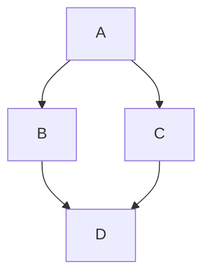

## 二级标题

### 三级标题

#### 四级标题

##### 五级标题

###### 六级标题

## Markdown基本及附加功能测试

这是一段基本Markdown格式的文字，包含**加粗**、*斜体*、***斜体加粗***、<u>HTML下划线</u>[^1]、~~删除线~~^[内联脚注测试]

[^1]: Markdown里并没有内置的下划线支持，对于下划线的实现，需要使用`<u></u>`的HTML标签，详情请见扩展阅读[1]

> 引用部分
>
>> 嵌套引用
>
> #### 引用内标题
>
> 无序列表
> 
> - First item
> - Second item
> - Third item
>     - Indented item
>     - Indented item
> - Fourth item
> 
> 有序列表
> 1. First item
> 2. Second item
> 3. Third item
>     1. Indented item
>     2. Indented item
> 4. Fourth item
>
>  *引用斜体*， **引用加粗**和~~引用删除线~~
>
> 引用代码块
> ```c++{6}
> #include <bits/stdc++.h>
> 
> using namespace std;
> 
> int main(int argc, char **argv) {
>   cout << "Hello, valaxy!" << endl;
>   return 0; 
> }
> ```

无序列表

- First item
- Second item
- Third item
    - Indented item
    - Indented item
- Fourth item

有序列表
1. First item
2. Second item
3. Third item
    1. Indented item
    2. Indented item
4. Fourth item

代码块
```c++
#include <bits/stdc++.h>

using namespace std;

int main(int argc, char **argv) {
  cout << "Hello, valaxy!" << endl;
  return 0; 
}
```

代码行高亮
```c++{6}
#include <bits/stdc++.h>

using namespace std;

int main(int argc, char **argv) {
  cout << "Hello, valaxy!" << endl;
  return 0; 
}
```

```js
export default {
  data () {
    return {
      msg: 'Removed' // [!code --]
      msg: 'Added' // [!code ++]
    }
  }
}
```

```js
export default {
  data () {
    return {
      msg: 'Error', // [!code error]
      msg: 'Warning' // [!code warning]
    }
  }
}
```

容器

:::

::: tip

tip

:::

::: warning

warning

:::

::: danger

danger

:::

::: info

info

:::

::: details Click to expand

Details Content

:::

单行代码`sudo vim /etc/resolv.conf`

超链接 [valaxy](https://valaxy.site/ "Valaxy official site")

超链接 *[Katyusha Mindpalace](https://katyusha.me/)*

邮箱 <katyusha0x26d@gmail.com>

图片


Emoji :tada:

Katax

When $a \ne 0$, there are two solutions to $(ax^2 + bx + c = 0)$ and they are
$$ x = {-b \pm \sqrt{b^2-4ac} \over 2a} $$

**Maxwell's equations:**

| equation                                                                                                                                                                  | description                                                                            |
| ------------------------------------------------------------------------------------------------------------------------------------------------------------------------- | -------------------------------------------------------------------------------------- |
| $\nabla \cdot \vec{\mathbf{B}}  = 0$                                                                                                                                      | divergence of $\vec{\mathbf{B}}$ is zero                                               |
| $\nabla \times \vec{\mathbf{E}}\, +\, \frac1c\, \frac{\partial\vec{\mathbf{B}}}{\partial t}  = \vec{\mathbf{0}}$                                                          | curl of $\vec{\mathbf{E}}$ is proportional to the rate of change of $\vec{\mathbf{B}}$ |
| $\nabla \times \vec{\mathbf{B}} -\, \frac1c\, \frac{\partial\vec{\mathbf{E}}}{\partial t} = \frac{4\pi}{c}\vec{\mathbf{j}}    \nabla \cdot \vec{\mathbf{E}} = 4 \pi \rho$ | _wha?_                                                                                 |

mermaid



UnoCSS

<div class="flex flex-col">

<div class="flex grid-cols-2 justify-center items-center">


</div>

</div>

# 扩展阅读

[[1]Markdown教程](https://markdown.com.cn/)

[[2]Markdown Extension - Valaxy](https://valaxy.site/guide/markdown)
